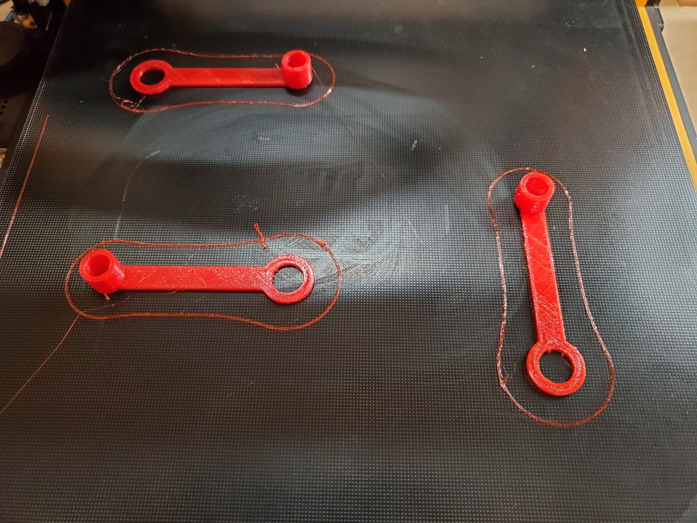
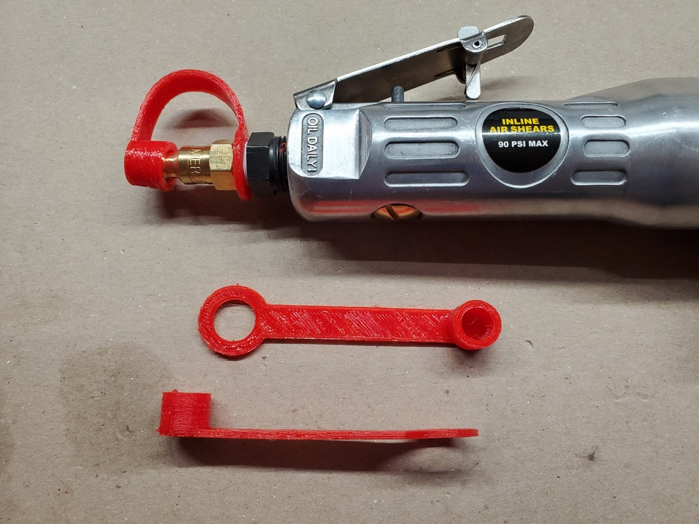

# Air Connector Dust Cover

This is a model of a dust cover/cap for standard US 1/4" 1/4" Industrial (a.k.a "I/M" or "Milton M-style" or "Type D") air tool connectors. It keeps the dust out of your air tools, and the little drips of oil (if applicable) in.

This is designed to be printed with a flexible filament such as TPU. On my CR-10S with a direct drive extruder, I printed using Hatchbox red TPU extruded at 240C, bed heat off, 50% infill, 0.2mm layer height, a print speed of only 15mm/s, and retraction disabled. I also had to loosen the screw on the extruder swing arm to reduce the spring tension.

For the 3-up print, the slicer (Cura) was instructed to print each object separately (one at a time). The 6-up print uses normal ordering.

