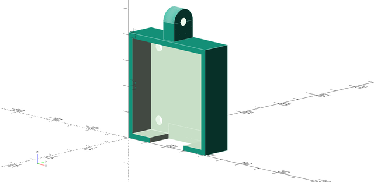
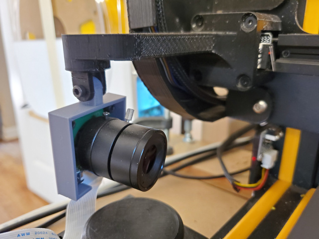
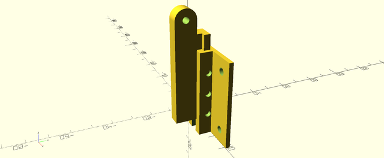
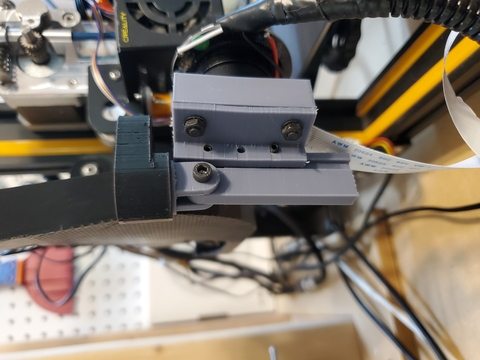

# Arducam_UC-261_mount

Camera mount for the Arducam UC-261 to use with the mounting system on [CR10 Camera Bracket by fellini - Thingiverse](https://www.thingiverse.com/thing:4279932).

## Vertical Adjustment

These additional pieces allow for vertical adjustment of the camera.

The backplate was originally designed to take 3x M2 threaded inserts, heat-set into the three holes, to clamp on to the mounting bar. However, the fit is close enough that screws don't seem to be necessary at all. If your print comes out without a close enough fit to hold the camera in place just by friction, you should be able to directly thread M3 grub screws into the holes.
