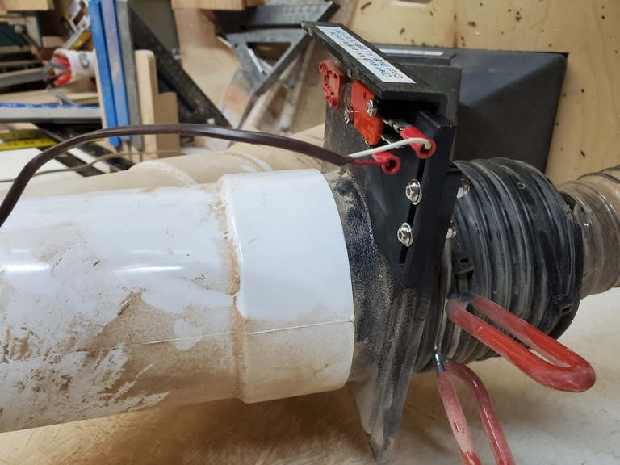
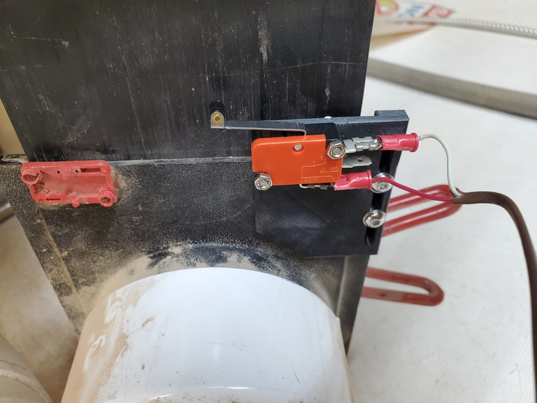
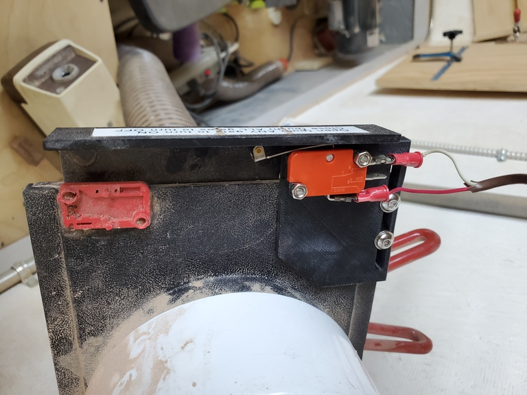

# Blast Gate Switch Mount

A 3d printed piece to mount a miniature snap-action switch on plastic 4" dust collection blast gates such as those sold by PowerTec and Fulton Woodworking.

The design uses the 3d model for [McMaster 7779K62](https://www.mcmaster.com/7779K62/) but this is a standard miniature snap-action switch form factor; the actual switches used are standard generic 1185RE8 / V-156-1C25 roller lever switches.

The switch attaches to this part using a pair of M3 countersunk flat head screws, with the heads countersunk in the bottom of the plate and the nuts on top of the switch. The plate attaches to the blast gate with a pair of M4x20mm screws through the slot on the side, with washers and nylock nuts; drill holes in the blast gate approximately 1/3 and 2/3 of the way down the slot and this should provide plenty of adjustability of the engagement between the gate and the switch.

