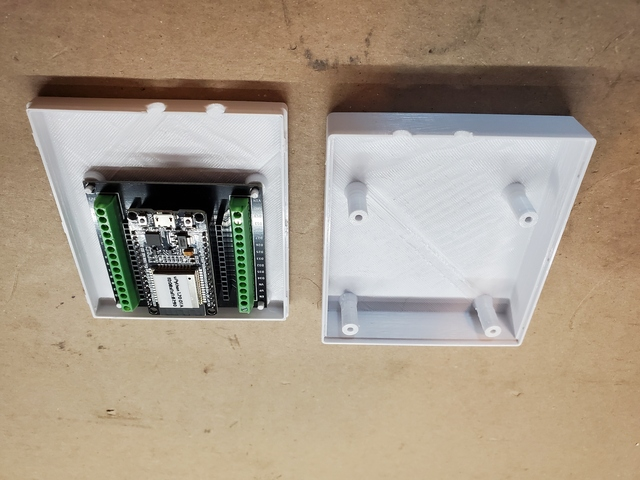

# ESP32 Boxes

Various boxes for projects using the ESP32 microcontroller.

## 30 Pin Breakout Board

[30pin-breakout-board.scad](30pin-breakout-board.scad) - A box with entry holes for USB (power) and a sensor cable, and a LED cutout, for one of the generic 30-pin ESP32 screw terminal breakout boards, such as [Amazon.com: AITIAO 4Pcs ESP32 Breakout Board 30Pin GPIO 1 into 2 for 30PIN ESP32 ESP32S Development Board : Electronics](https://www.amazon.com/dp/B0BQ2N4MSZ?psc=1&ref=ppx_yo2ov_dt_b_product_details). These boards fit the 30-pin ESP32 development boards with 26mm / 1.02" header spacing, such as the [NodeMCU ESP-WROOM-32 ESP-32S](https://www.amazon.com/gp/product/B086MLNH7N/) or the [WEOOM-32U](https://www.amazon.com/gp/product/B09Z7Q5LKQ/).

[30pin-breakout-board-XL.scad](30pin-breakout-board-XL.scad) is the same but 1 inch taller and with 1 inch more padding on all sides.

## 38 Pin Wide Breakout Board

[38pin-wide-breakout-board-medium.scad](38pin-wide-breakout-board-medium.scad) - Similar to the above [30 Pin Breakout Board](#30-pin-breakout-board) but for a 38-pin "wide" breakout board such as [Amazon.com: risingsaplings 3pcs ESP32 Terminal Breakout Board 38 Pins GPIO Expansion Board Compatible for ESP32-DevKitC 0.9" or 1.0" Size Module : Electronics](https://www.amazon.com/dp/B0C3QM5ZHP?psc=1&ref=ppx_yo2ov_dt_b_product_details) which fits a 38-pin board with 1.0" pin spacing, such as [Amazon.com: DORHEA 4PCS ESP32-DevKitC Core Board ESP32 Development Board ESP32-WEOOM-32U Wireless WiFi Development Board Amplifier Filter Module : Electronics](https://www.amazon.com/gp/product/B09Z7Q5LKQ/ref=ppx_yo_dt_b_search_asin_title?ie=UTF8&psc=1). The board gets screwed to the bottom piece using M3x6mm flat head screws instead of held using pins, as the mounting holes on this board are underneath the ESP. This box also has a bit more padding around the board than the original [30pin-breakout-board.scad](30pin-breakout-board.scad) but less than the "XL", hence `-medium`.

## 30 Pin Breakout Board with 12V USB Power Supply

[30pin-breakout-board-12v-usb-power.scad](30pin-breakout-board-12v-usb-power.scad) - Like [30pin-breakout-board.scad](30pin-breakout-board.scad), above, but also with room and screw mounting holes for a 12V to 5V USB buck converter like [this one from Amazon](https://www.amazon.com/dp/B0B74LMHB2). I used #8 x 1/2" wood screws to mount the converter.

[30pin-breakout-board-12v-usb-power-XL.scad](30pin-breakout-board-12v-usb-power-XL.scad) is the same but 1 inch taller and with 1 inch more padding on all sides.
