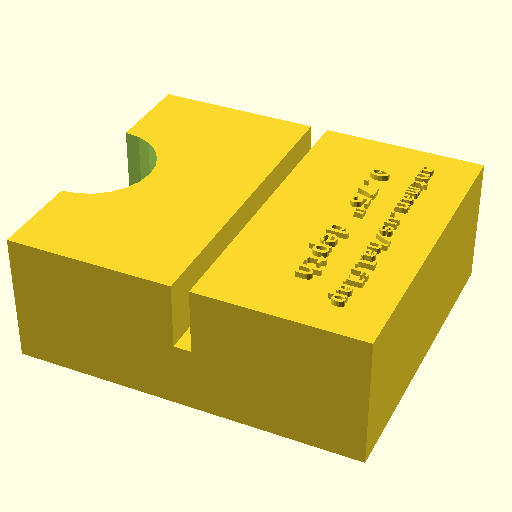
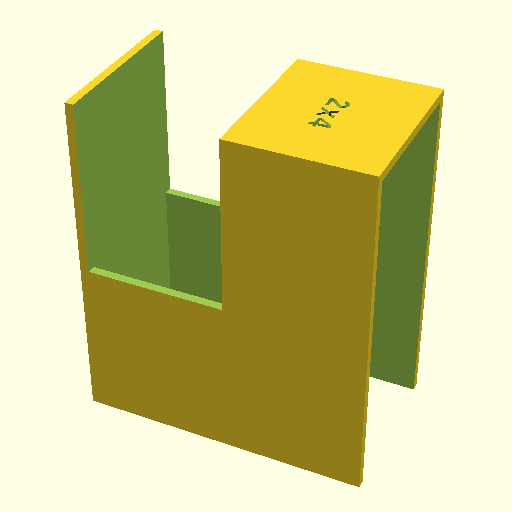

# half_lap_templates

A set of templates for marking half-lap joints on dimensional lumber, along with blocks for setting depth stops on saws and routers.

**Files are currently configured for US 2x4" nominal lumber**, but all of the SCAD files are parametric, so it should be possible to adjust them for other size boards via [config.scad](config.scad).

## Included Models

[depth_narrow_face.scad](depth_narrow_face.scad) - Depth gauge for router and saw half-lap on narrow face. Print with 10-20% infill and no supports.

 - Depth gauge for router and saw half-lap on wide face. Print with 10-20% infill and no supports.

 - Depth gauge for router and saw, lapping narrow face for a wide face. Print with 10-20% infill and no supports.

 - Template for marking half-lap cuts on the wide face in the middle of a board, meeting half the narrow face end of a board. Print at 100% infill with supports.

 - Template for marking half-lap cuts on the narrow face in the middle of a board, meeting the narrow face end of a board. Print at 100% infill with supports.

 - Template for marking half-lap cuts on the narrow face on the end of a board. Print at 100% infill with supports.

 - Template for marking half-lap cuts on the wide face in the middle of a board, meeting the narrow face end of a board. Print at 100% infill with supports.

 - Template for marking half-lap cuts on the wide face in the middle of a board. Print at 100% infill with supports.

 - Template for marking half-lap cuts on the wide face on the end of a board. Has two slots, one for lapping boards wide-face to wide-face, and one for lapping wide-face to end. Print at 100% infill with supports.

`` function, which comes from [modules/as_mm.scad](modules/as_mm.scad), and takes a single ``convert_to_mm`` boolean parameter. Normally, this parameter is false, and you see the model in inches. When the model is converted to an STL file for printing, ``convert_to_mm`` is overridden to be ``true``, so the STL file is scaled to mm.
