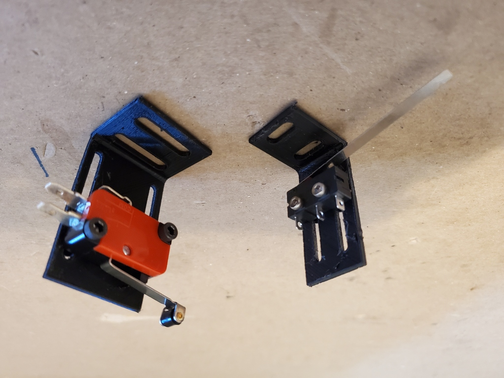
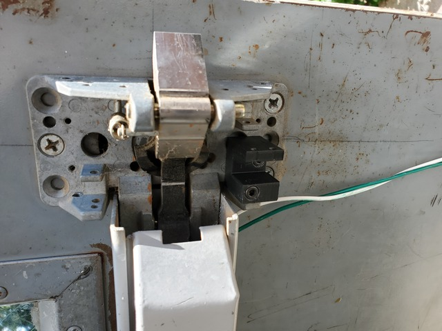
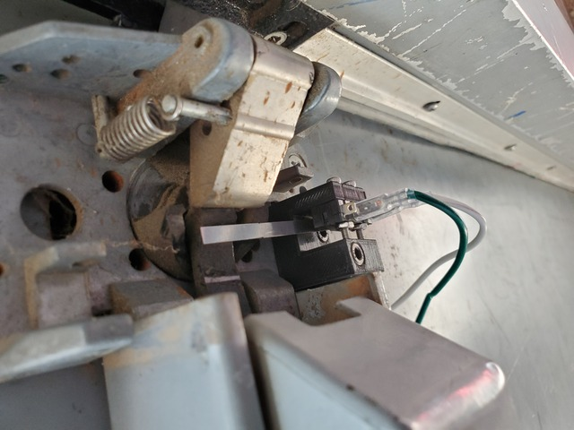
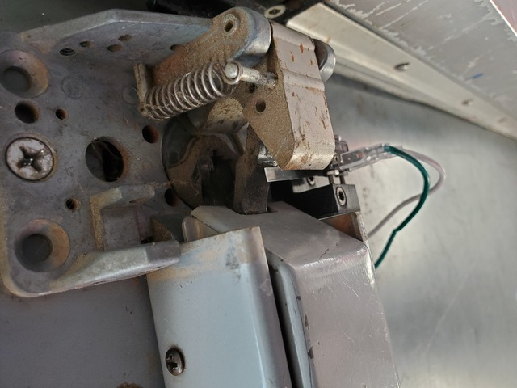

# Limit Switch Brackets

Some generic brackets for mounting common limit switches.

In general, the switches we're talking about here are:

* **mini(ature)** - Common miniature limit switches such as the generic V-156-1C25; these switches have a body that's 1.09" (27.68mm) long, 0.63" (16mm) tall, and 0.41" (10.41mm) wide with 0.12" (3mm) diameter mounting holes at opposite corners. The mounting holes are spaced on center 0.88" (22.35mm) apart length wise and 0.41" (10.41mm) apart height wise. A good example of this part, including 2D drawings and a 3D model, is [McMaster 7779K62](https://www.mcmaster.com/7779K62/) but this form factor is widely available through electronics suppliers, Amazon, etc.
* **submini(ature)** - Another common form factor of snap-acting switches, usually termed "subminiature". These come in a package that is 0.79" (20mm) long, 0.40" (10.2mm) tall, and 0.26" (6.4mm) wide with a pair of 0.1" (2.5mm) diameter mounting holes next to each other near the bottom edge of the switch, spaced 0.37" (9.5mm) apart on center. Again, these are widely available standard sizes, but [McMaster 7658K15](https://www.mcmaster.com/7658K15/) has 2D and 3D models of this form factor.

## Brackets

* `mini_yz` - A tall L-bracket for the mini switches, with mounting screw slots for adjustment in the Y and Z axes. Switch mounts with M3x16mm socket head cap screws with a washer and nut on the back.
* `submini_yz` - A tall L-bracket for the submini switches, with mounting screw slots for adjustment in the Y and Z axes. Switch mounts with M2.5x12mm socket head cap screws with a washer and nut on the back.

## Sargent 20 Latch Limit Switch

`sargent-20-latch-switch`

This is a bracket specific to fitting inside the latchbolt chassis on a [Sargent 20-series Exit Device](https://www.sargentlock.com/en/commercial-locks-products/exit-devices-panic-bars/mechanical/product-details.aehpdp-20-seriess-aeh_sargent_58951), for mounting a limit switch to detect when the latch is retracted (i.e. either via the bar being depressed, or the bar being dogged down).  Switch mounts with M2.5x16mm socket head cap screws with a nut on the back. Bracket mounts to the door/exit device with a pair of M4 socket head cap screws (one 12mm long and one 30mm long) in drilled and tapped holes.
