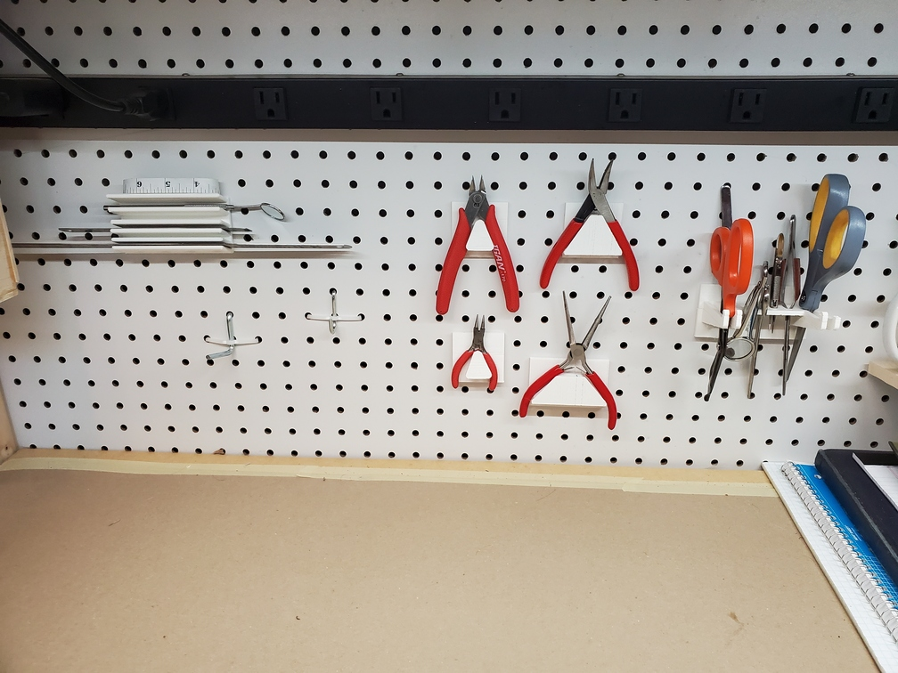

# pegboard

A collection of holders for pegboard.

These are based around [cilynx's Parametric Pegboard Base from Thingiverse](https://www.thingiverse.com/thing:2583402).

* ``ruler_holder`` - A little multiple shelf-type-thing to hold rulers and other long thin objects.
* **Broken:** ``cutter_holder`` - A holder for small electronics-type cutters/end nippers. This is based on [thingiverse 4950608](https://www.thingiverse.com/thing:4950608). Note that this model is broken; the triangle that forms the support and the triangle in front of it are actually separate planes, and print disconnected. This could be fixed with some CA glue, but is far from ideal.
* ``bent_nose_plier_holder`` and ``needle_nose_plier_holder`` - Holders for various small pliers. These were inspired by the above but are my own design from scratch, and all one piece. These are built up from [rounded_trapezoid.scad](rounded_trapezoid.scad)
* ``tweezer_holder`` - A holder for various scissors and tweezer-like things.
* ``tweezers_only_holder`` - Similar to ``tweezer_holder`` but without the scissor holders on the sides
