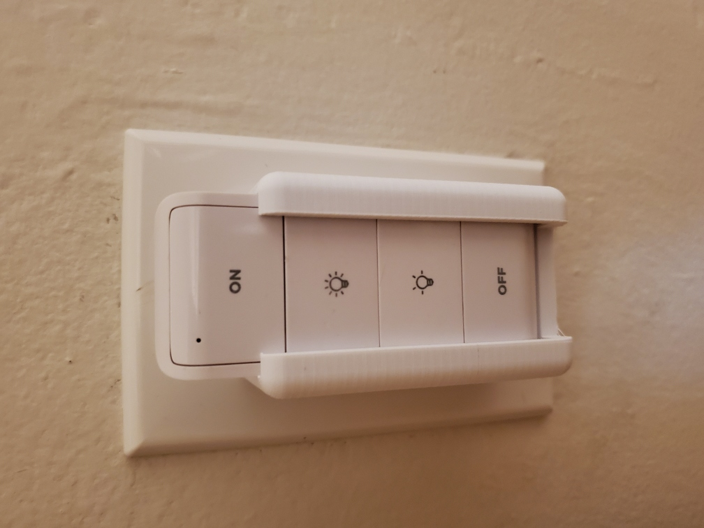
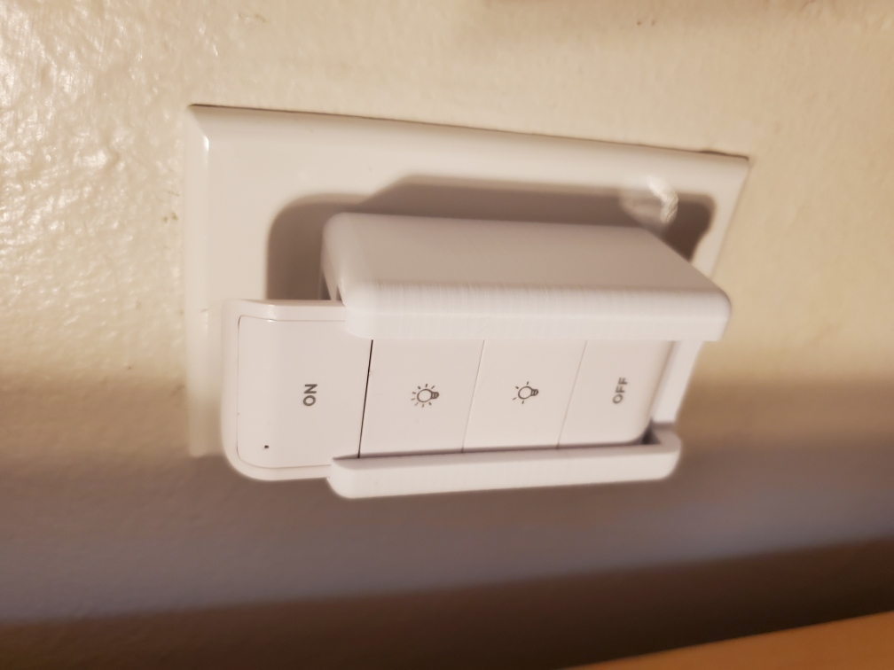
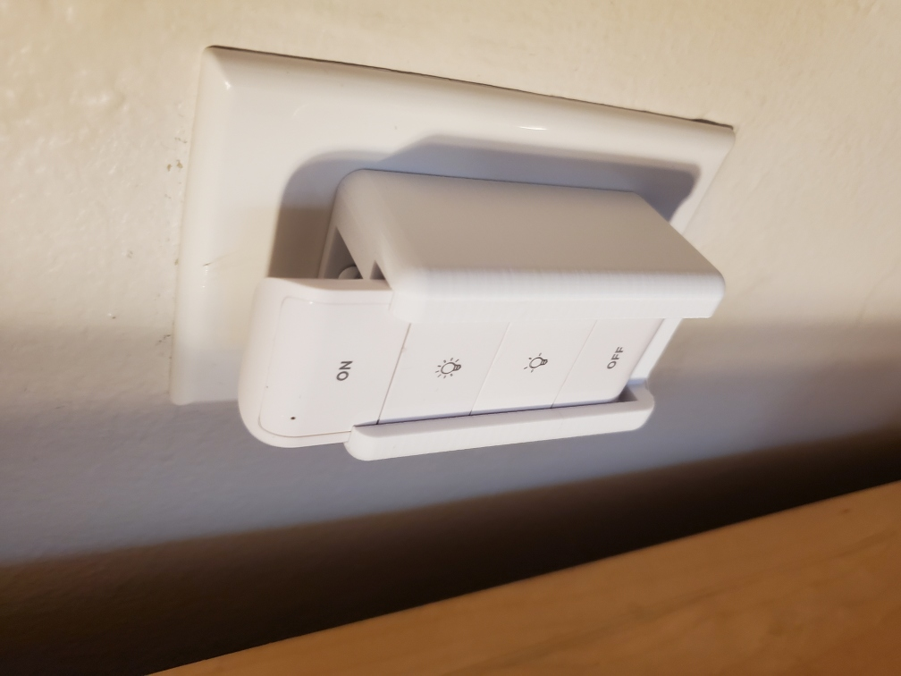
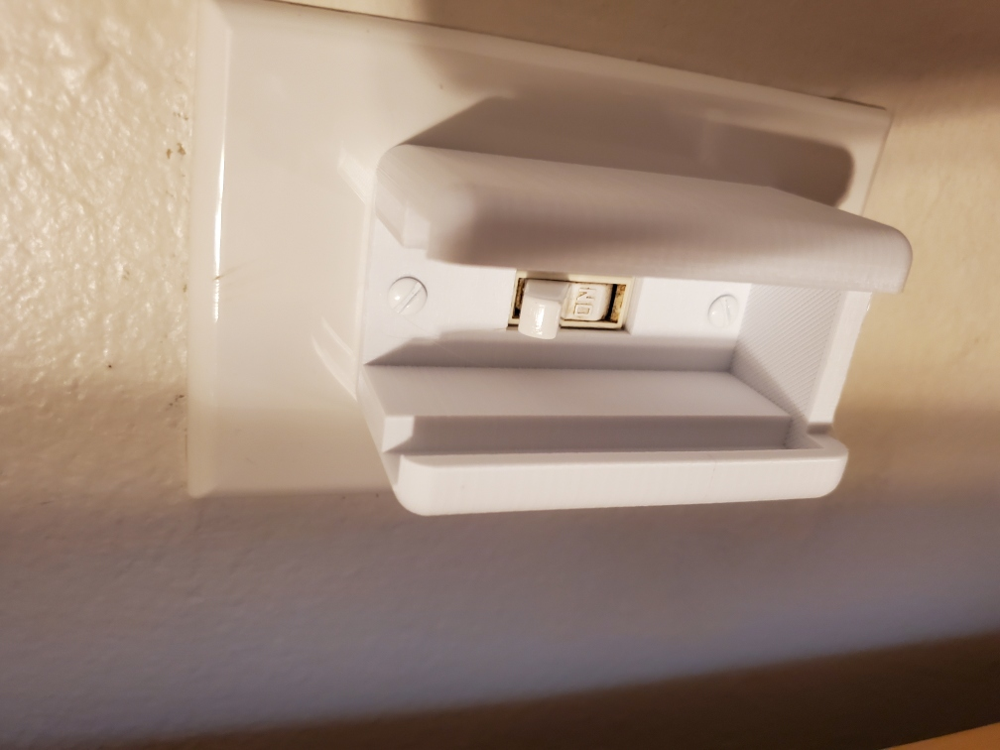
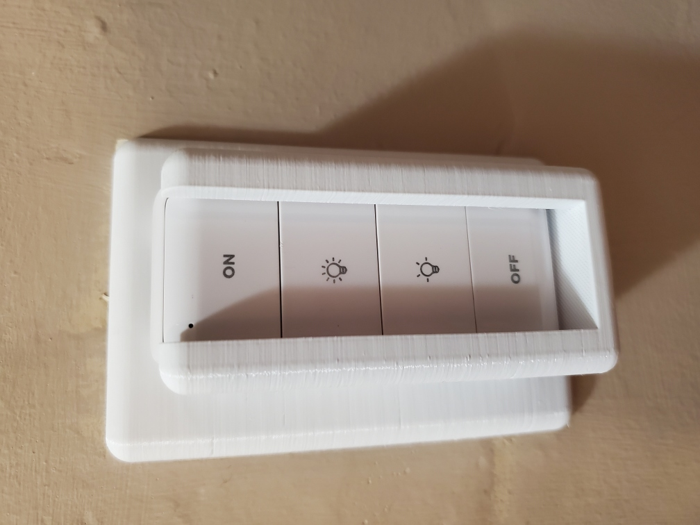
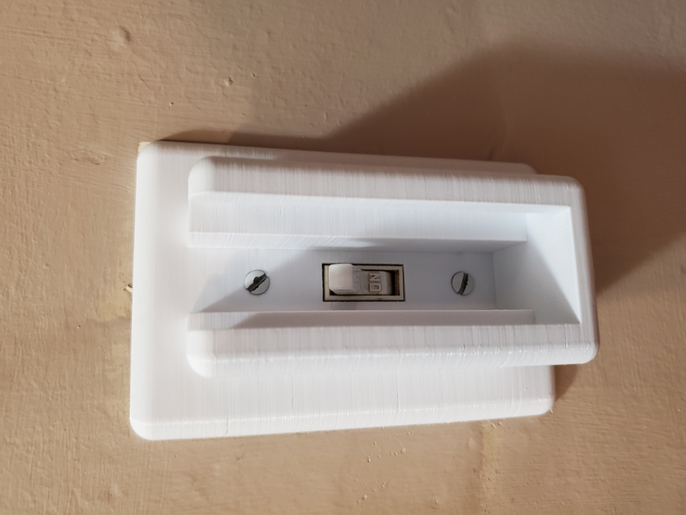
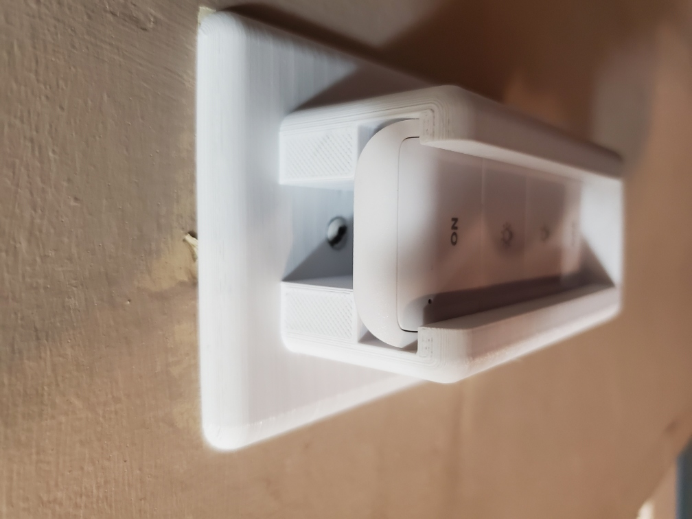

# Sengled Zigbee Remote Wall Plate

Standard US-style toggle light switch wall plate that holds a [Sengled E39-G8C](https://smile.amazon.com/gp/product/B07QHDV5S4/) Zigbee remote control in front of the toggle switch, but lets you access the switch by sliding the remote out.

## holder_only.scad

[holder_only.scad](holder_only.scad) / [holder_only.stl](holder_only.stl) Remote holder that screws on top of a standard size device-mount wall plate with a toggle switch.

## main.scad

[main.scad](main.scad) - Remote holder with an attached standard-size, device-mount wall plate.

Photos are of a slightly earlier version:

## Notes

I found a number of existing libraries for generating wall plates, but just to be sure I decided to model this on a plate taken right off one of the switches in my house, which I knew would fit correctly.

This is designed for standard US wall plate screws, which are #6-32 thread with an 82-degree countersunk head. The screw holes are 2.375" center to center.
