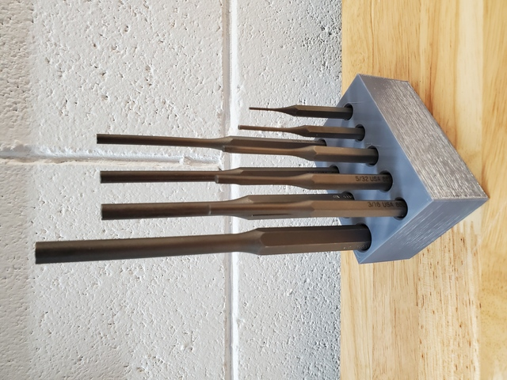
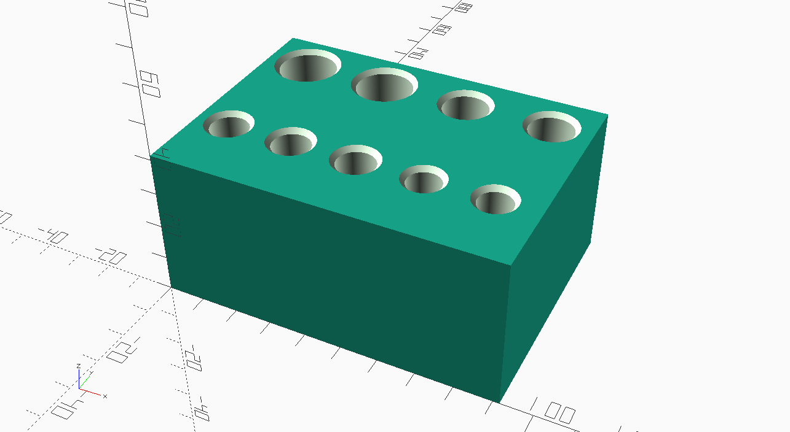
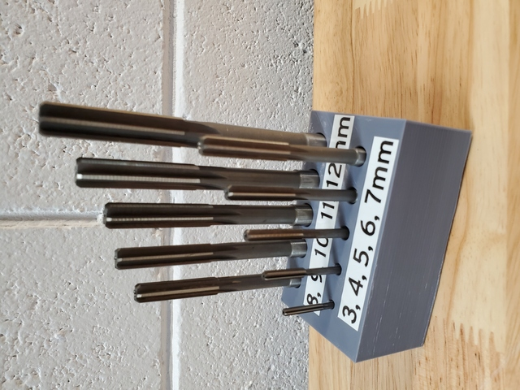
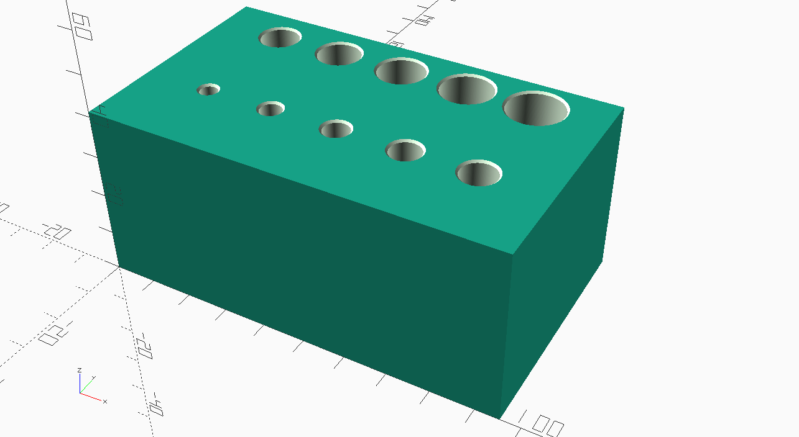

# Tool Holder Blocks

Various blocks with holes to store tools vertically.

## Tekton Punch Set

Storage for the Tekton PNC92001 9-piece 1/16-3/8 inch pin punch set ([Amazon](https://www.amazon.com/gp/product/B08PCDHRPR/)).

* [tekton_punch_set.scad](tekton_punch_set.scad)
* [tekton_punch_set.stl](tekton_punch_set.stl)

## 3-12mm Metric Reamers

Storage for a set of 3-12mm metric chucking reamers, integer mm sizes, such as [this cheap uxcell set on Amazon](https://www.amazon.com/gp/product/B08ZM5TN75/).

* [metric_reamers_10pc.scad](metric_reamers_10pc.scad)
* [metric_reamers_10pc.stl](metric_reamers_10pc.stl)

